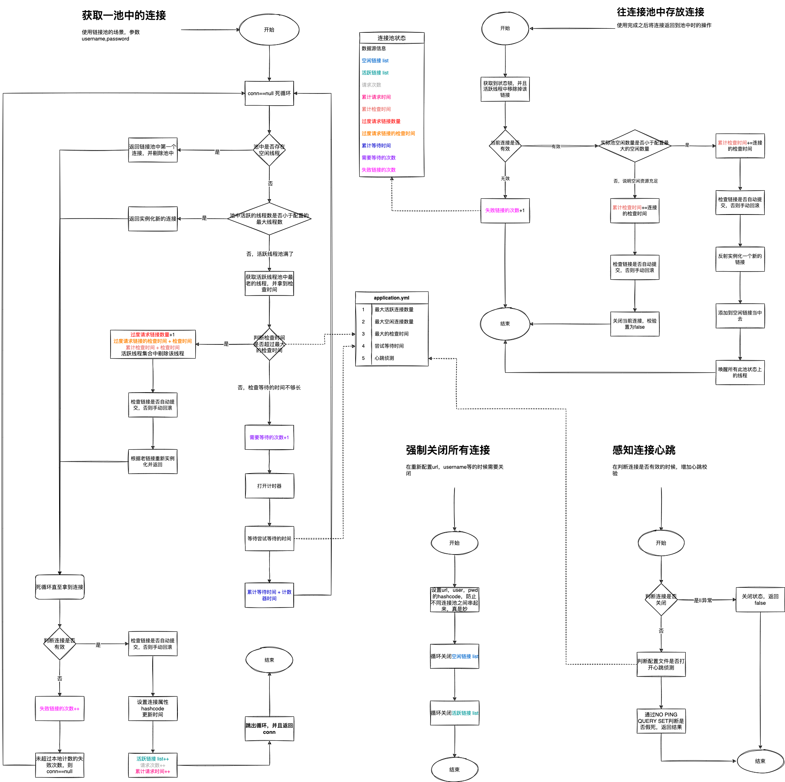

参考资料：
 - [https://bugstack.cn/md/spring/develop-mybatis](https://bugstack.cn/md/spring/develop-mybatis/2022-03-20-第1章：开篇介绍，手写Mybatis能给你带来什么？.html)

## 创建简单的映射器代理工厂
当我们来设计一个 ORM 框架的过程中，首先要考虑怎么把用户定义的数据库操作接口、xml配置的SQL语句、数据库三者联系起来。其实最适合的操作就是使用代理的方式进行处理，因为代理可以把一个复杂的流程封装为接口对象的实现类

 - MapperProxy 映射器的代理实现类，包装对数据库的操作
 - MapperProxyFactory 提供工厂，实例化 MapperProxy。为每个 dao 接口生成代理类

## 数据源池化技术实现
获取/回收 池化连接的过程
[PooledDataSource.java](./src/main/java/cc/tianbin/mybatis/datasource/pooled/PooledDataSource.java)

